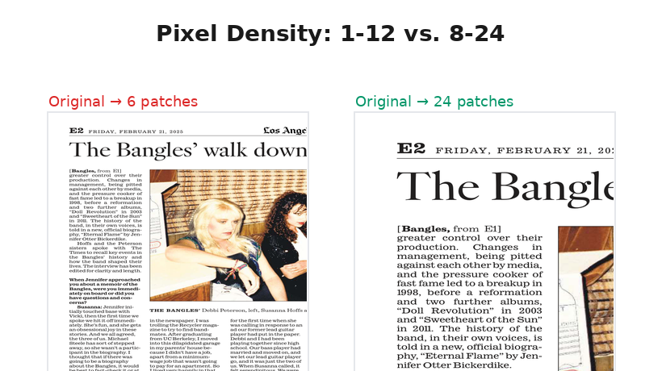
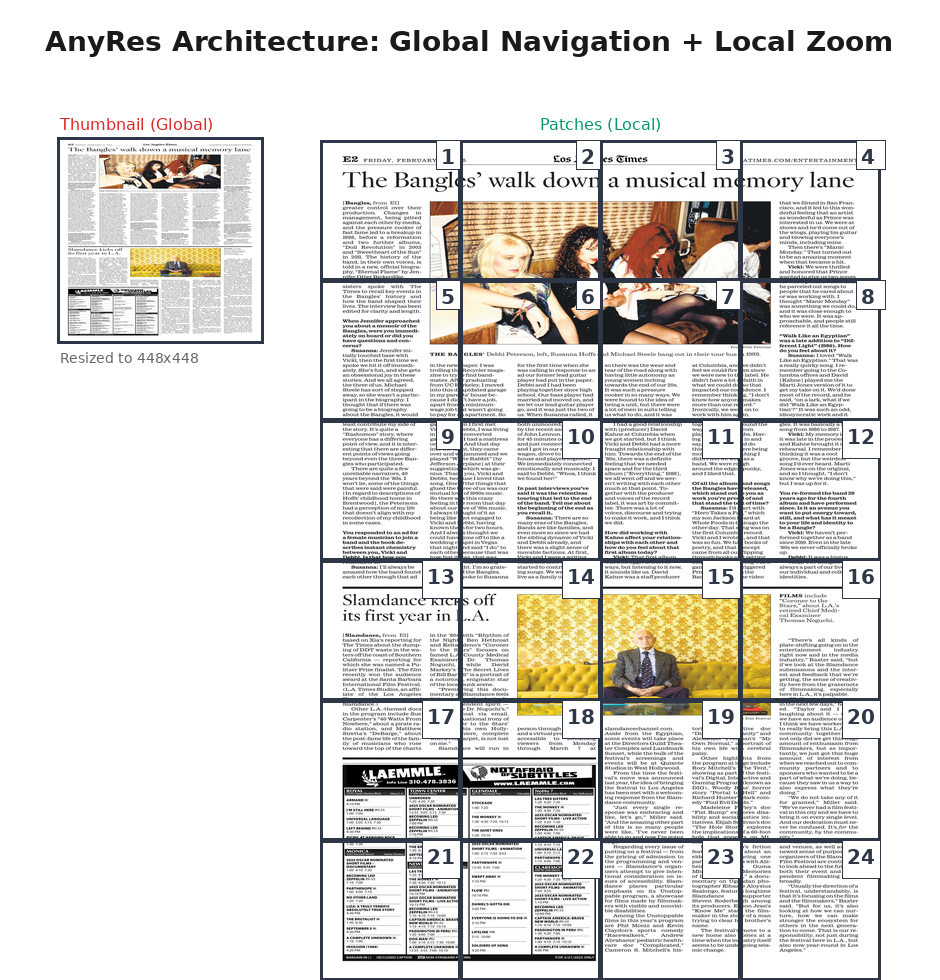
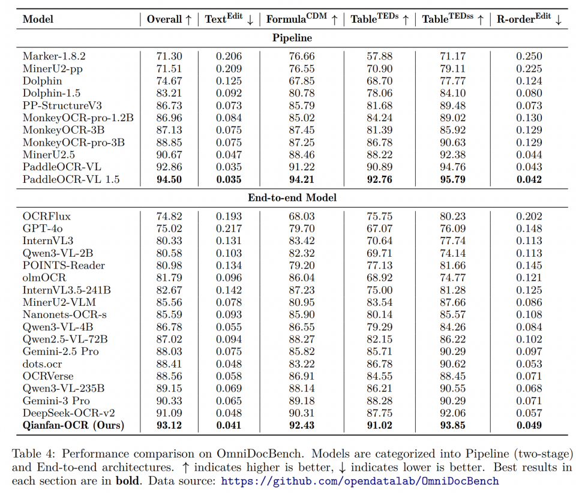

# VLM 文档解析架构演进：从“感官精度”到“逻辑对齐”的像素主权之争

## 1. 行业拐点：为什么“语义纠错”不再是灵丹妙药？
在 VLM 进入"深水区"的今天，业界达成了一个残酷的共识：**如果视觉编码器（Vision Encoder）在输入端就丢失了 $\sum$ 的上下标或表格的虚线边框，后端的 LLM 参数量再大也只能是"空中楼阁"。**

以往我们寄希望于 LLM 强大的语义联想能力来补全模糊的 OCR 结果，但在金融报表、科研论文等容错率为零的场景下，这种“联想”往往演变为致命的“幻觉”。

Qianfan-OCR 在 **OmniDocBench v1.5** 这一严苛的基准测试中，凭借 **93.12 分**的成绩领跑所有端到端模型。这一成绩背后的核心逻辑在于：**与其在后端缝补，不如在前端实现对原始像素的“感知主权”。**

---

## 2. 空间离散化路径：AnyRes 的“像素暴力美学”
**代表模型：** Qianfan-OCR (arXiv:2603.13398), InternVL 2.5

### 2.1 高分辨率的“低保真”困局
传统的 AnyRes（AnyResolution）架构通过将图像切分为 $448 \times 448$ 的 patches 来保留细节。但很多模型在处理简单文档时为了节省 Token，会将 patch 数量下限设得很低（如 1 或 4）。

**Qianfan-OCR 的工程直觉：**
在解析密集文档（如报纸、审计报告）时，我们发现比例适配（Aspect Ratio）固然重要，但**采样密度（Sampling Density）**才是真正的生命线。

### 2.2 为什么 AnyRes 在工程上更可取？
虽然 NaViT 理论上像素利用率更高，但在 Qianfan-OCR 的技术选型中，AnyRes 展现出了极强的**生产稳定性**：

1. **全局-局部双路导航：** AnyRes 强制保留的低频全局流（Thumbnail）提供了极其宝贵的“上帝视角”，这对于理解跨栏排版、通栏标题的宏观结构至关重要，而 NaViT 的纯序列模式有时会迷失在局部长序列中。
2. **算子成熟度：** AnyRes 完全兼容标准 TensorRT 加速和固定尺寸的算子优化，在 4B 这种追求极致推理性价比的模型上， AnyRes 能提供更稳定的吞吐量。

---

## 3. 深度对撞：报纸类复杂数据解析的“神话”与“现实”
业界曾有一种认知：像报纸这种长比例、多栏位的极端数据，必须靠 NaViT 的弹性打包（Native Resolution）才能解决。**Qianfan-OCR 打破了这一迷思。**

### 3.1 像素密度 vs. 比例适配
报纸解析的痛点不在于它“长”，而在于它“密”。一份 A3 尺寸的报纸可能包含数万个字符。

* **NaViT 的理论优势与现实风险：** 虽然 NaViT 允许设置像素上下限，但其核心逻辑是“几何自适应”。在处理极端长宽比的报纸时，为了维持全局几何关系，采样点往往被稀释在漫长的像素序列中。在固定的 Token 预算下，NaViT 容易陷入“看全了，但细节特征被平均化”的尴尬。
* **Qianfan-OCR 的 AnyRes 强化版**： 我们放弃了极致的像素利用率，选择了**"感知下界"策略**。通过将 $min\_patch$ 强行拉高到 8，我们为每一份文档预留了至少 2048 个视觉 Tokens 的"底薪"。

    这种设计的巧妙之处在于：即使布局再复杂的报纸，每个原子块（Patch）都能在 $448 \times 448$ 的原生视野下被编码。这意味着我们不是在"缩放"报纸，而是在用 8 到 24 个"高倍显微镜"去扫描报纸。这种高采样密度的暴力美学，从物理层面掐断了由于视觉模糊引发的"语义幻觉"。

---

## 4. 技术深度对比：AnyRes vs. NaViT
|维度|AnyRes（Qianfan-OCR）|NaViT（原生几何路径）|
|---|---|---|
|**核心逻辑**|高频采样 + 全局宏观导航|几何还原 + 低冗余感知|
|**小字/密集字符**|极强（强制最小 patch 数，密集文本零遗漏）|受 Token 预算约束，大图下采样密度下降|
|**报纸/复杂排版**|全局缩略图锚定布局，跨区域语义连贯|几何还原准确，但缺乏全局视图，多区域语义存在断裂风险|
|**工程落地**|标准算子，易量化，推理吞吐量高|变长序列依赖定制 Attention 算子，部署成本较高|
|**典型表现**|公式、表格、图表结构化解析精度领先|倾斜/非标准宽高比场景几何鲁棒性更强|

*源自：https://arxiv.org/pdf/2603.13398*

---

## 5. 进化终局：从感知精度走向逻辑约束
提升视觉感知的“感官精度”只是第一步，Qianfan-OCR 未来的演进将聚焦于**“逻辑对齐”**。

1. **架构侧（Architecture）：** 计划在 AnyRes 的基础上引入类似 **Token Packing** 的机制，在保持高分辨率的前提下，通过 Mask 掉无效的 Padding 区域，进一步榨取推理性能。
2. **对齐侧（Alignment）：** 借鉴 **GRPO（Group Relative Policy Optimization）** 范式，在生成阶段引入结构合法性约束。

    * **不再只是“看图说话”：** 通过强化学习奖励模型，强制模型在输出表格时闭合标签，在输出公式时遵循 LaTeX 语法。
    * 这种机制将确保模型在处理噪声场景（如模糊、反光）时，即使感知略有受损，也能基于逻辑一致性生成正确的文档表示。

---

## 6. 结语
从 Qianfan-OCR 的实践来看，VLM 文档解析的胜负手不在于架构的“玄学”，而在于**对工程边界的极致追求**。

我们选择 AnyRes 并通过 $8 \sim 24$ patch 策略将其推向性能巅峰，是因为在当前的硬件与应用环境下，**“看得清”永远比“排版美”更重要。** 未来，我们将继续在保持像素主权的基础上，探索强化学习带来的逻辑约束，让 VLM 真正读懂每一份复杂文档。

---