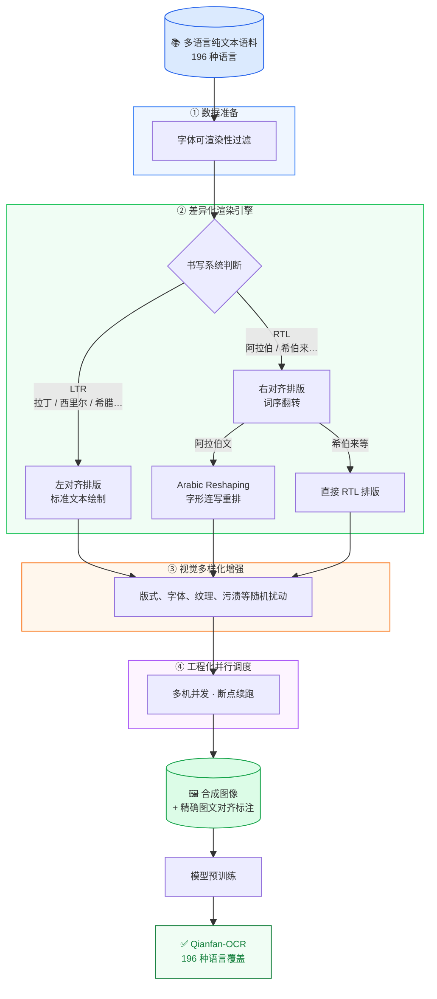

# 多语言优化Blog

## 背景

当前全球化场景对 OCR 模型的多语言覆盖能力提出挑战，传统 OCR 往往只在少数主流语言上表现稳定，而在低资源语言、复杂字体、特殊书写系统下，识别效果通常会明显下降。很多低资源语言天然缺少高质量标注数据，而真实 OCR 标注又成本很高，很难依靠纯人工方式把语言覆盖做大。

业界在合成数据方面已有诸多探索：SynthText [1] 开创了自然场景文本合成的范式；TRDG（TextRecognitionDataGenerator）[2] 作为开源工具被广泛用于 OCR 数据增强；SynthTIGER [3] 进一步提升了合成文本的真实感与多样性。近期，基于扩散模型的方法（如 TextDiffuser [4]、TextFlux [5]）开始探索用生成模型直接生成文本图像，在风格迁移上展现出潜力。然而，这些工作大多聚焦于英文或少数主流语言，对 196 种语言级别的覆盖、复杂书写系统的正确渲染缺乏系统性支持。

我们的工作在借鉴已有合成范式的基础上，重点解决多语言场景下的字体可渲染性校验与差异化渲染问题，具体流程如下图所示。从高质量多语言纯文本出发，通过可控渲染与扰动建模，自动合成出接近真实文档场景的图像，同时天然得到精确的图文对齐标注。在 Qianfan-OCR 的多语言能力升级中，我们围绕合成数据的正确性和真实性进行优化，最终将模型支持语言范围扩展到了 196 种。

## 1. 字符过滤和差异化渲染，保证正确性

基于文本合成图片时，需要依据语言选择合适的字体，但仍存在个别字符不受字体支持的可能，导致渲染失败、标注错误。因此，我们在数据准备阶段专门做了一层"字体可渲染性过滤"。具体做法是：

- 基于 `fonttools` 预先为每种字体生成其支持字符集，并持久化缓存
- 正式合成前，优先查询缓存，快速校验文本能否被当前字体覆盖
- 对未命中缓存的字体，动态生成字符集并补充回存
- 在极端情况下，再用 `Pillow` 做逐字符渲染校验作为兜底

此外，多语言场景下，不同书写系统不能用同一套渲染逻辑简单处理。例如，阿拉伯文不仅是从右到左书写，还涉及字符在不同位置的字形变化；如果只做普通文本绘制，视觉结果会天然错误。为此，我们在渲染阶段做了差异化适配，重点包括：

- 自动识别 RTL 语言，并启用右到左排版逻辑
- 针对阿拉伯等需要字形重排的语言，引入字符重排机制，保证视觉连写正确
- 结合按词宽度测量的自动换行与对齐策略，确保多行文本稳定排布

通过以上两个策略，强化了多语言反向合成 pipeline 面对不同文本和字体的鲁棒性与正确性。对不同语言的合成效果如下图所示。

## 2. 视觉多样化，增强真实性

考虑到简单合成图像与真实应用场景模型面临的输入存在差距，在图像合成阶段，我们进一步加入了多样化版式与视觉建模，包括：

- 字体、字号随机采样，增加字体多样性
- 页边距、行距、词间距、页面尺寸随机扰动
- 分栏、跨页、页面边缘等文档结构模拟
- 随机的墨迹、污渍与轻微的字体变形
- 纹理背景叠加，增强纸质文档质感与真实分布接近性

这些设计让训练数据与业务场景更加贴近，增强了模型对真实文档结构与版式变化的泛化能力。

**字体多样性展示**：为了让 OCR 模型学到"识别字符本身"而非"记住某种特定字体的像素模式"，我们在合成时随机采样不同风格的字体。下图展示了同一段拉丁文本在四种字体下的渲染效果。

**版面多样性展示**：真实历史文档的版面形式多样——有单栏、有双栏，也有摊开的书页。为了覆盖这些场景，我们在合成阶段引入了版式随机化。

**视觉扰动展示**：真实场景中的文档图像往往带有各种视觉噪声——扫描仪的纹理、纸张的底色、打印质量的差异、历史的侵蚀等。为了让合成数据覆盖这些真实分布，我们设计了多级视觉扰动。

## 总结与展望

基于构建的多语言反向合成数据，对 Qianfan-OCR 模型进行预训练，显著扩展模型语言覆盖范围；在低资源语言上识别准确率明显提升；在复杂字体、噪声场景下鲁棒性增强；多语言混合场景下整体性能更加稳定。

当前方案仍存在一定局限：在视觉建模层面，每张图片目前主要由一种语言构成，文档的透视变换、光照变化、页边批注等也尚未覆盖；在场景覆盖层面，主要面向印刷体文档，手写文本、自然场景文字、商标 Logo 等场景的模拟仍有挑战。

未来，这套体系可沿多个方向演进：
- 借鉴 DocSynth [6] 的复杂版式设计能力，进一步丰富文档结构建模
- 参考 SARD [7] 等针对特定语言深度优化的合成方案，将其语言专属的增强策略迁移融合到多语言框架中
- 同时引入透视变换、光照扰动等视觉增强，探索多字体混排与手写风格合成，逐步覆盖更广泛的应用场景

通过"反向合成 + 工程化生产"的范式，可以持续、低成本地扩展多语言 OCR 的数据基础，为全球化场景下的文档智能提供支撑。

## 参考文献

[1] A. Gupta, A. Vedaldi, and A. Zisserman, "Synthetic data for text localisation in natural images," in *Proceedings of the IEEE Conference on Computer Vision and Pattern Recognition (CVPR)*, 2016, pp. 2315–2324.

[2] G. Belval, TextRecognitionDataGenerator, 2018. [Online]. Available: https://github.com/Belval/TextRecognitionDataGenerator

[3] M. Yim et al., "SynthTIGER: Synthetic text image generator towards better text recognition models," in *Proceedings of the International Conference on Document Analysis and Recognition Workshops (ICDARW)*, 2021, pp. 109–124.

[4] M. Chen et al., "TextDiffuser: Diffusion models as text painters," *arXiv preprint* arXiv:2305.10855, 2023.

[5] Y. Xie et al., "TextFlux: An OCR-Free DiT model for high-fidelity multilingual scene text synthesis," *arXiv preprint* arXiv:2505.17778, 2025.

[6] S. Biswas, P. Riba, J. Lladós, and U. Pal, "DocSynth: A layout guided approach for controllable document image synthesis," in *Proceedings of the International Conference on Document Analysis and Recognition (ICDAR)*, 2021.

[7] O. Nacar et al., "SARD: A large-scale synthetic Arabic OCR dataset for book-style text recognition," *arXiv preprint* arXiv:2505.24600, 2025.
